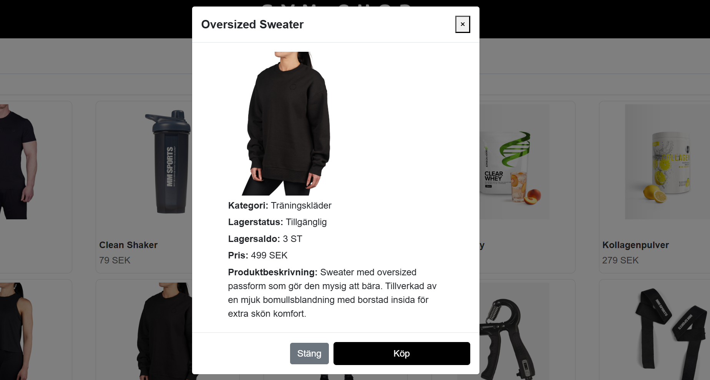

# Gym Shop

## Description

Gym Shop is a full-stack e-commerce application inspired by MM Sports. 


The project is build with Blazor WebAssembly for the frontend and ASP.NET for the backend. The application manages customers, accounts, product catalogs, shopping carts, and order processing 
with secure JWT-based authentication. 


Usrs can log in as either administrators or customers. New customers can register directly on the website. Administrators have acecss 
to management features such as editing products and monitoring orders. To test the admin featurs, you can use the following credentials:

**Email:** admin@admin.com

**Password:** Lösenord


Data is stored in SQL Server, following the three normal forms to ensure performance and integrity. The backend is structured using the 
Repository Pattern and Unit of Work for clear and scalable architecture. 

## Features

* **Dynamic inventory management** - Products automatically switch to "Out of Stock" when their quantity reaches zero.



* **Cart validation** - Customers cannot add more products to the cart than what is available in stock.


* **JWT-based authentication** - Secure API access with token authentication


* **Hashed passwords** - Enhanced security for user credentials.
* **Responsive frontend** - Blazor WebAssembly ensures a fast and interactive user experience.


## Installation and Usage

1. Clone the repository:
   ```bash  
   git clone https://github.com/modigida/GymShop.git
3. Download the database backup and restore it in SQL Server Management Studio (SSMS).
5. Add your connectionstring and JWT settings in appsettings.default.json


## Technologies

* **Blazor WebAssembly** - Frontend
* **ASP.NET API** - Backend
* **SQL Server** - Database
* **Entity Framework Core** - ORM for database access
* **Repository pattern & Unit of Work** - Design pattern for clear architecture
* **JWT Authentication** - Secure authentication
* **BCrypt** - Password hashing


